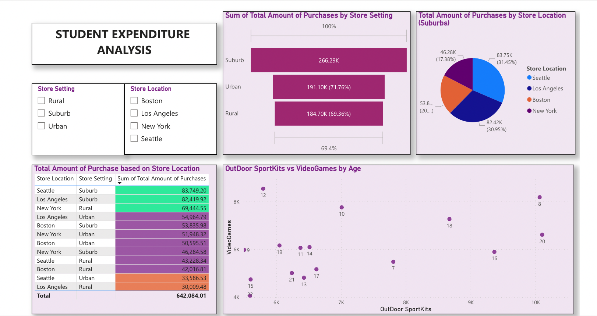
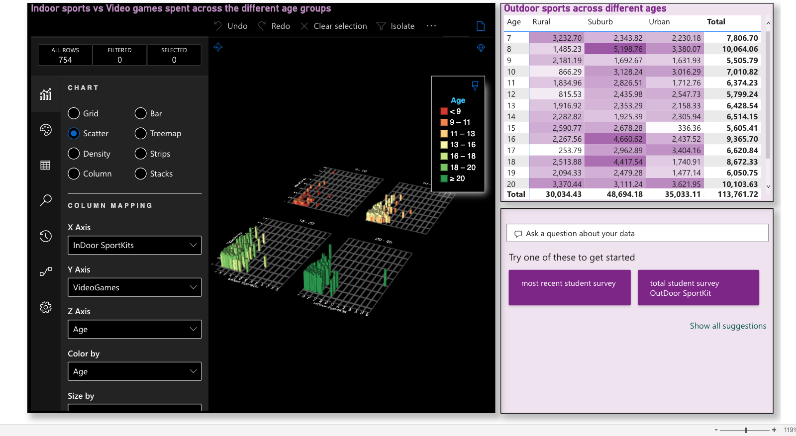

# Power BI Report for Student Expenditure Analysis

The survey data was collected from multiple stores to determine the amount of money that students spend on different items such as video games, indoor games, toys, books, and gadgets. The student survey data was analyzed to gain valuable insights.

## Dashboard Overview

## The Power BI report was created with the following elements:

1. A tabular visualization was formatted to display the total amount of purchase based on store location and store setting. The records were color-coded based on the total amount of purchase.

2. A matrix visualization was created to show the amount spent on outdoor sports across different ages and store setting. The total amount spent on outdoor sports was color-coded.

3. A funnel chart was created to show the total amount of purchase by store setting. The data labels were displayed as a percentage of the total value.

4. A pie chart was created to show the total amount of purchase by different store locations for the suburban store setting only. The filter context was used to limit the data to the suburban store setting.

5. A scatter plot was created to show the relationship between video game purchases and outdoor sports spent across different ages.

6. A sand-dance plot was created to show the relationship between indoor sports and video games spent across different age groups.

7. The report was published on the Power BI cloud service and a master dashboard was designed to consist of the funnel chart and scatter plots. A schedule refresh was set to occur six times a day, every 4 hours.

8. The Q&A feature of Power BI was used to display information such as the average age of students and a donut chart showing the total amount of purchases in suburbs.
